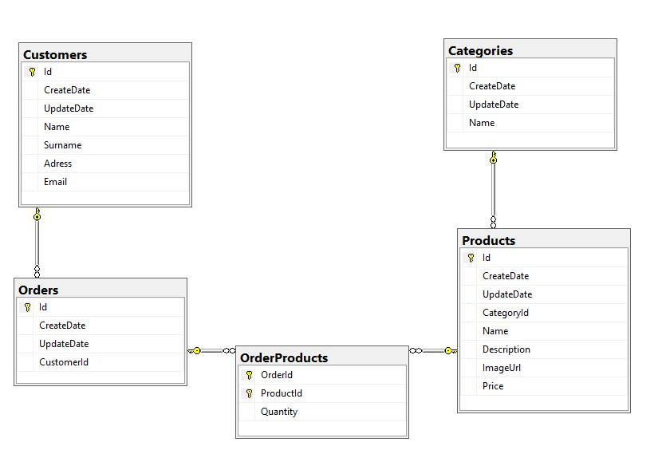

# Inveon Fullstack Bootcamp E-Commerce Project

> Admin Panel User Authentication is fake. Controlled by just frontend
>
> > **username** : admin
> > **password** : 123

> [Go live](https://inspiring-stonebraker-c3db34.netlify.app)

### I used _Azure_ for the backend deployment

## Database Diagram

## Technologies, Libraries and Tools

-   .Net Core 5.02
    -   Entity Framework
    -   Sql Server
-   React
    -   Material UI
    -   Context Api
    -   Formik
    -   Axios
    -   react-router-dom
    -   Bootstrap
    -   React-bootstrap
    -   Alertifyjs

## Video Sources I Use

> [Folder Structer of React](https://www.youtube.com/watch?v=XEO3mFvrDx0)

> [React Router Dom](https://www.youtube.com/watch?v=zEQiNFAwDGo)

> [Material Dialog](https://www.youtube.com/watch?v=5akdtwtmjZM)

> [Inspired for Admin Panel Design](https://www.youtube.com/watch?v=aTPkos3LKi8)
